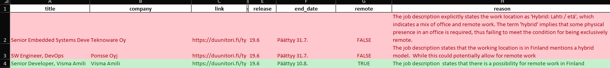

# 🚀 RPA Jobs: Smarter Job Search with AI & Automation

Welcome to **RPA Jobs**! This project makes your job hunting easier by automating the search and analysis of job listings using RPA and AI. 

**Tired of unclear remote work info on Duunitori?**  
This projects AI digs deeper to reveal hidden remote opportunities and other key details—so you never miss out on your dream job!

- Simply by running task logic you will be generated a list such as this that will help you in your job hunt.   

## 🖼️ Example Output

---

## ✨ Key Features

- **🔎 Smart Web Scraping:** Automatically collects all relevant job listings (e.g., Python roles) from Duunitori.
- **🤖 AI-Powered Analysis:** Uses language models to extract and interpret crucial info—like remote work options, skills required, and company details—even from vague descriptions.
- **📊 Actionable Excel Reports:**  Generates an Excel file, highlighting the most interesting positions and making it easy to filter and sort opportunities.

---

## 🕹️ Selenium Automation

- Harnesses **Selenium WebDriver** to seamlessly navigate and scrape job listings from Duunitori—no manual browsing required!

---

## 🧠 AI Integration

- **Deep Job Insights:** AI analyzes each listing for remote possibilities, required skills, and more.
- **Natural Language Processing:** Understands and clarifies ambiguous or incomplete data.
- **Automated Decision-Making:** Cuts down manual review time and boosts efficiency in finding the best jobs.

---

## 📈 Excel Output

- **Comprehensive Summary:** Every processed job listing is neatly organized in an Excel file.
- **Key Columns:** Includes job title, company, location, remote possibility (AI-determined), and other must-know attributes.
- **Easy Filtering:** Quickly sort and filter to zero in on the most relevant opportunities.

---

## Upcoming features
- Next the project will be able to be ran in containers. 

> **Level up your job search with automation and AI—find better jobs, faster!**
---

